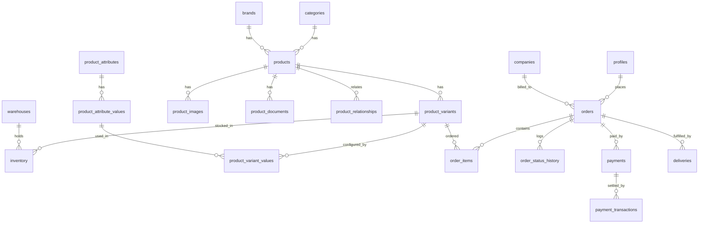
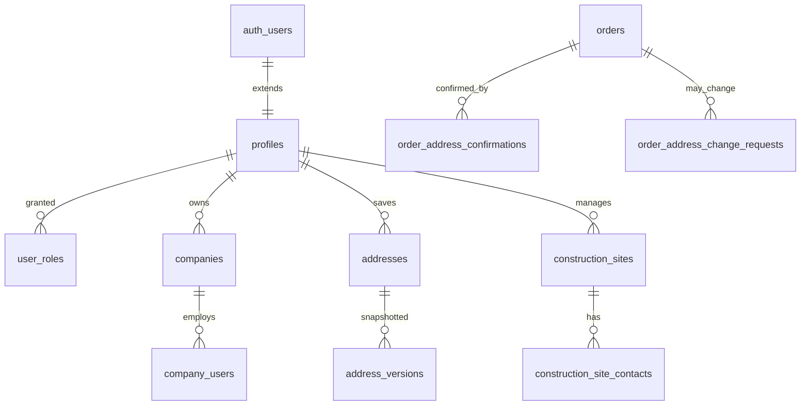
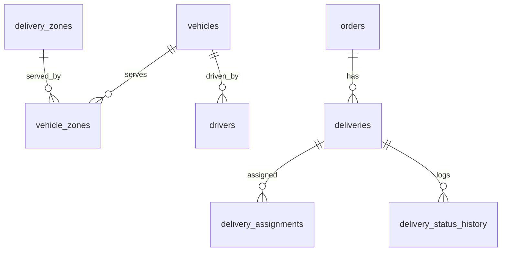
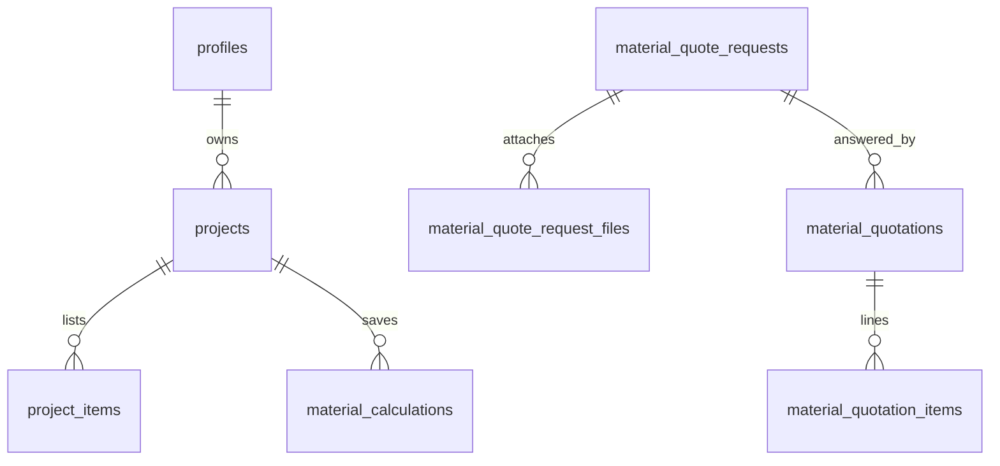
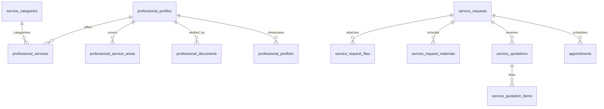
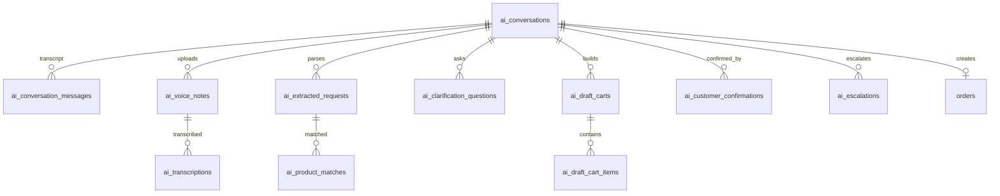

# Database — Entity Relationship Structure

Deliverable #2 (§44). Full DDL: `supabase/migrations/0001_core_schema.sql`.
~90 tables grouped by domain. Below is the relationship overview; every table
has `created_at`/`updated_at` and (where relevant) `deleted_at` for soft delete.

## Core commerce relationships



## Identity, addresses & construction sites



## Logistics



## Quotations, projects & calculators



## Handyman marketplace



## AI ordering assistant



## Cross-cutting

`reviews`, `disputes`, `claims` (+ `claim_files`), `notifications`,
`promotions`, `translation_status`, `audit_logs`, `system_settings`,
`product_synonyms`.

## Money & measurement conventions

- **Money**: integer minor units (`*_minor bigint`) to avoid float rounding.
- **Weight**: kilograms (`numeric`). **Dimensions**: centimetres. **Volume**:
  cm³ (derived) — consistent with the vehicle-matching engine.
```
