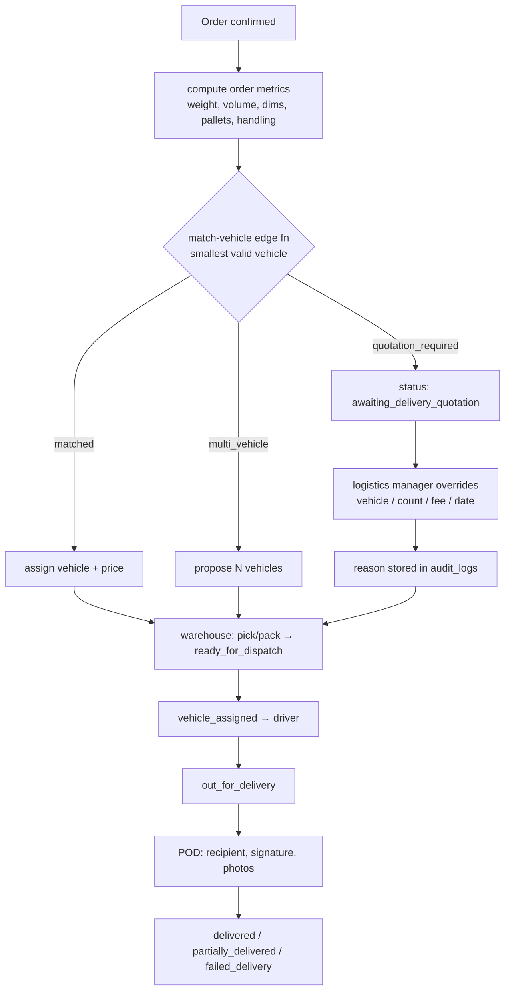
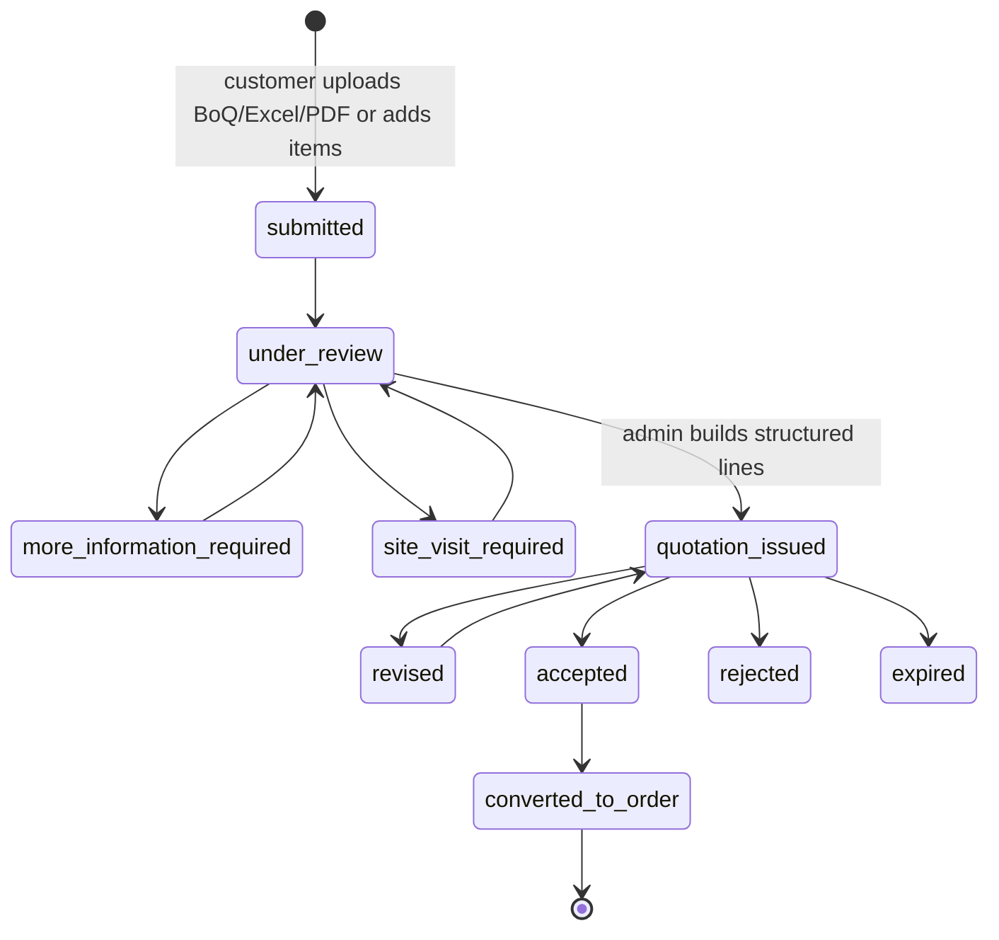
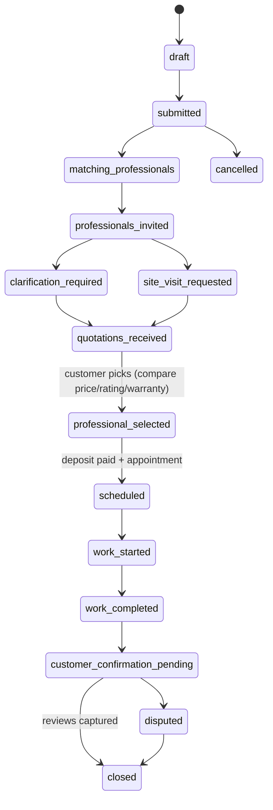
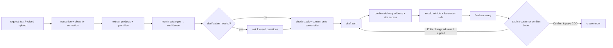

# Workflows

Deliverables #5–#8 (§44): order, delivery, material-quotation and
handyman-quotation workflows. Statuses map to the enums in
`0001_core_schema.sql`.

## 1. Order workflow (§20 + Additional order statuses)

```mermaid
stateDiagram-v2
  [*] --> ai_draft: AI assistant
  [*] --> draft: web cart
  ai_draft --> customer_clarification_required
  customer_clarification_required --> customer_confirmation_required
  draft --> address_confirmation_required: checkout
  customer_confirmation_required --> address_confirmation_required
  address_confirmation_required --> pending_payment: address confirmed
  pending_payment --> payment_verification_required: card/bank
  pending_payment --> confirmed: COD eligible
  payment_verification_required --> confirmed: webhook verified
  confirmed --> under_review
  under_review --> awaiting_delivery_quotation: engine=quotation_required
  under_review --> preparing: engine matched
  awaiting_delivery_quotation --> preparing: logistics quoted
  preparing --> partially_prepared
  preparing --> ready_for_dispatch
  ready_for_dispatch --> vehicle_assigned
  vehicle_assigned --> out_for_delivery
  out_for_delivery --> delivered
  out_for_delivery --> partially_delivered
  out_for_delivery --> failed_delivery
  delivered --> closed
  confirmed --> cancelled
  delivered --> return_requested
  return_requested --> refund_pending --> refunded --> closed
```

**Stock reservation** happens only on: successful online payment, confirmed COD
order, approved contractor PO, or accepted quotation (§28). The AI/clarification
statuses **do not** reserve stock (Additional order statuses rule).

Every transition writes `order_status_history` (status, staff, customer note,
internal note, timestamp). Sensitive transitions run in service-role functions.

## 2. Delivery workflow (§16–§18)



## 3. Material quotation workflow (§21)



Accepted quotations convert directly into an order (reusing lines → `order_items`).

## 4. Handyman quotation / job workflow (§24–§25)



Purchased materials from the store attach to the request
(`service_request_materials`) so the professional sees which materials are
included (§26).

## 5. AI-assisted order confirmation (Additional Req 2)



The order is **never** created from a voice note, transcription, upload or
initial message alone — only after a visible confirmation action (AC #13, #14).
```
